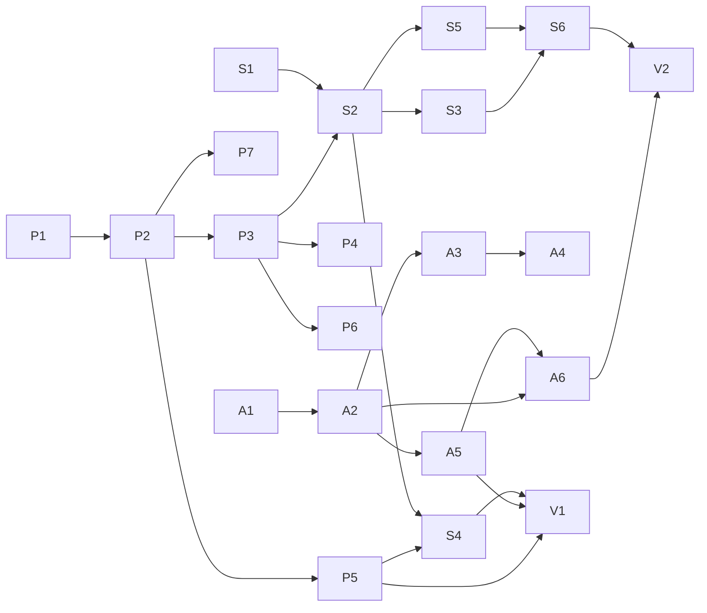

# Formal Models — Wolfram-Verified Boundaries and DAG Plan

> **Source authority:** `local://evoclj-implementation-dag.md` (the design doc is `local://`, non-repo; this `docs/formal/` is its frozen projection) and `local://wave1-context.md` (GC-01..24, INV-01..09 before S6).
> **When to read:** You are reviewing, extending, or adversarially testing permissions, subagents, or async commands; or you need the DAG topology (waves, critical path) that constrains commit order.
> **What this directory is not:** A superseder of `docs/implementation-plan.md` — the implementation plan is normative for milestones 1–9. These files solidify the **permission / subagent / async objects** and the **21-node DAG** (§2–§4 of the DAG doc) at the V1 milestone after S6.

---

## 1. File map

| File | Covers | Wolfram checks | Implements |
|------|--------|----------------|------------|
| [`perm-model.md`](perm-model.md) | `CapabilityLease` boundary, dual-anchor subject, attenuation, revocation, `EffectiveAccess = Surface ∩ Lease`, per-kind action sets, DB mirror, seq-continuity discovery | [W-01..W-15] (15) | P1–P7 |
| [`subagent-model.md`](subagent-model.md) | `SubAgentSession` 8-state SM, spawn / child runtime / cancel cascade / result delivery, `subagent_links` graph, depth/budget caps, causal `cause` (GC-20) | [W-16..W-19] (4) | S1–S6 |
| [`async-model.md`](async-model.md) | `AsyncCommand` 6-state SM, durable `commands` table, same-transaction outbox, dispatch/succeed/fail/timeout/cancel, orphan recovery, append-only event chain with positional `seq` + sha256 hash chain | [W-20..W-27] (8) | A1–A6 + shared chain |
| This file | Index + aggregate verification (26/26) + DAG topology (21 nodes, 25 edges, 7 waves, critical path) | All 26 | V1 |

Each model file carries its own Wolfram table, its Malli/DDL snippets, and the DAG slice that places it on the overall plan. The aggregate summary below is the cross-file reader (26 checks, 7 waves, critical path) so a reviewer need not chase three files for the totals.

---

## 2. Aggregate Wolfram verification — 26/26 pass

Wolfram Language modeled the three object families as closed predicates (`valid*Q`) and the implementation plan as a directed graph, then machine-checked the invariants.

```
CapabilityLease  [W-01] validSubjectQ                  pass
                 [W-02] resourceKindQ                 pass
                 [W-03] actionsNonEmptyQ              pass
                 [W-04] positiveWindowQ               pass
                 [W-05] rejectMissingPhenotype         pass
                 [W-06] rejectIllegalAction            pass
                 [W-07] rejectZeroWindow               pass
Derivation       [W-08] narrowDerivation               pass
                 [W-09] rejectExpandActions            pass
                 [W-10] rejectExtendExpiry             pass
                 [W-11] downwardClosed                 pass
Revocation+EA    [W-12] preRevokeAllows                pass
                 [W-13] postRevokeDenies (fail-closed) pass
                 [W-14] effectiveAccessIntersectionRO  pass
                 [W-15] effectiveAccessBothAllow       pass
SubAgentSession  [W-16] edgesLegalQ                    pass
                 [W-17] allReachableFromCreatedQ       pass
                 [W-18] cancelledTerminalQ             pass
                 [W-19] completedTerminalQ             pass
AsyncCommand     [W-20] edgesLegalQ                    pass
                 [W-21] acyclicQ                       pass
                 [W-22] fourTerminalsSinkQ             pass
                 [W-23] queuedToSucceededPathQ         pass
                 [W-24] queuedToTimedOutPathQ          pass
EventChain       [W-25] seqPositionalContinuousQ       pass  ← see §3
                 [W-26] causeStrictlyEarlierQ          pass
                 [W-27] sha256HashChainQ               pass
```

**First-pass outcome:** 25/26 passed without rephrase. [W-25] exposed that the original phrasing "seq values are the multiset `{1..M}`" accepts `{1,3,2}` as correct — ordered set equality hides the positional error. The fix was to restate [W-25] as `events[i].seq = i+1` (positionally continuous `1..M`). After that rephrase the suite was 26/26. The current `store/event` + guard tests lock the positional form. See `perm-model.md` §4 and `async-model.md` §4 for the full story.

---

## 3. DAG verification (Wolfram graph checks)

The 21-commit plan of `local://evoclj-implementation-dag.md` §2 (P1–P7, A1–A6, S1–S6, V1–V2) was modeled as a directed graph with 25 edges, then checked with Wolfram graph routines.

### 3.1 Topology

```text
Nodes: 21   Edges: 25   Type: DAG
Edges (A → B means A must land before B):
  P1→P2   P2→P3   P2→P5   P2→P7   P3→P4   P3→P6   P3→S2   P5→S4
  A1→A2   A2→A3   A2→A5   A2→A6   A3→A4   A5→A6
  S1→S2   S2→S3   S2→S4   S2→S5   S3→S6   S5→S6
  P5→V1   A5→V1   S4→V1   A6→V2   S6→V2
```



* **Acyclic = true** (25 edges, no loop — necessary for any topological order to exist).
* **Sources** (no predecessors, may start immediately): `{P1, A1, S1}` — the three wave-1 leaves touch disjoint files and can run in isolated worktrees.
* **Sinks** (no successors): `{P7, V2}` — `P7` (capability storage) is an optional leaf; `V2` is the final doc sink.
* One legal topological order (Wolfram): `S1 P1 P2 P7 P5 P3 S2 S5 S4 S3 S6 P6 P4 A1 A2 A5 V1 A6 V2 A3 A4` — any order that respects the edges above is legal; this was one witness that the order exists.

### 3.2 Seven waves (Kahn, Wolfram)

| Wave | Commits | Focus |
|------|---------|-------|
| W1 | P1, A1, S1 | three chain entries, parallel (disjoint files) |
| W2 | A2, P2 | outbox txn + single issuance surface |
| W3 | A3, A5, P3, P5, P7 | widest (five) — dispatch, recovery, dual-anchor, revoke generalization, storage |
| W4 | A4, A6, P4, P6, S2 | deadline/cancel, futures elimination, attenuation, per-kind actions, subagent spawn |
| W5 | S3, S4, S5 | subagent runtime, cascade revoke, result + orphan handling |
| W6 | S6, **V1** | agent tool surface + **this directory** (V1 solidification) |
| W7 | V2 | `docs/scheduler.md` async/subagent semantics follow-up |

### 3.3 Critical path

```
P1 → P2 → P3 → S2 → S3 → S6 → V2      (6 edges, 7 commits)
```

* The longest chain is the **permission chain (P1..P3) → subagent chain (S2..S6) → doc (V2)**. The async chain (A-series) is off the critical path — it runs alongside and does not add depth. That is why W3 can host three async commits without lengthening total time.
* 7 waves = critical-path length — no redundant waiting; each wave carries exactly one critical-path commit.
* The gate is **P3** (dual-anchor subject) — S2 cannot start before it, and P3 itself gates S2 alongside P5's revoke work for S4.

---

## 4. Reading notes

* **Routing into a model:** start from the file map (§1 above). Each of the three detailed files is self-contained — you can read `perm-model.md` without knowing subagent internals, and vice versa — but the DAG slice in each §7 cross-references the others.
* **Per-commit detail:** `local://evoclj-implementation-dag.md` §2 holds the 21-row acceptance table (file footprint + machine-executable passing criterion). These three formal files record the *objects*, not the table.
* **Migration to implementation:** greedily search (`grep`) — `CapabilityLease` only minted via `mint-lease!`; `commands.state` only written via the five transition helpers; `subagent_links` only written via `spawn-subagent!`. The per-file References sections list the test namespaces that lock each predicate.
* **Hash hygiene:** `scripts/verify-doc-hashes.clj` scans `docs/` recursively. All four files in `docs/formal/` contain no bare `7..40` hex tokens, so they contribute zero candidates and pass `exit 0` without E3 exemptions. The only `sha256:` tokens they contain are the `sha256:…` schema literals — those are stripped by rule E2 before scanning, so they never enter the candidate set. Adding a real commit reference to any file requires that it resolve (`git rev-parse` check) or be annotated with an adjacent marker (`example: …` within two non-word chars) — see `verify-doc-hashes.clj` header for E1–E4.

---

## 5. Implementation footprint (where the models live)

| Model | Primary files |
|-------|---------------|
| Permission | `src/evoclj/capability/schema.clj`, `mint.clj`, `lease.clj`, `broker.clj`, `policy.clj`, `src/evoclj/mount/filesystem.clj`, `resources/migrations/013-capabilities.sql` |
| Subagent | `src/evoclj/intent/schema.clj`, `intent/dispatch.clj`, `src/evoclj/runtime/subagent.clj`, `src/evoclj/store/session.clj` (DDL+state), `src/evoclj/store/recovery.clj` (orphans), `src/evoclj/tool/specs.clj` |
| Async + Chain | `src/evoclj/store/command.clj`, `resources/migrations/012-commands.sql`, `src/evoclj/store/recovery.clj`, `src/evoclj/store/event.clj`, `src/evoclj/environment/registry.clj`, `src/evoclj/mcp/adapter.clj` |

All three families persist causal events through `store/event` and its `canonical-header` / `hash/text-digest` digest.

---

## 6. References

* Design sources: `local://evoclj-implementation-dag.md` §1 (object boundaries), §2 (21 rows), §3 (DAG edges), §4 (waves + critical path), §1.7 (discovery); `local://wave1-context.md` (GC-01..24, INV-01..09, three-leaf wave-1 discipline).
* Pinned siblings: `perm-model.md` §1–§8, `subagent-model.md` §1–§8, `async-model.md` §1–§7.
* Verification tools: Wolfram Language (26 predicates + graph checks), `scripts/verify-doc-hashes.clj` + `test/evoclj/support/doc_hashes_test.clj`, and the per-model test suites (see each file's References).
