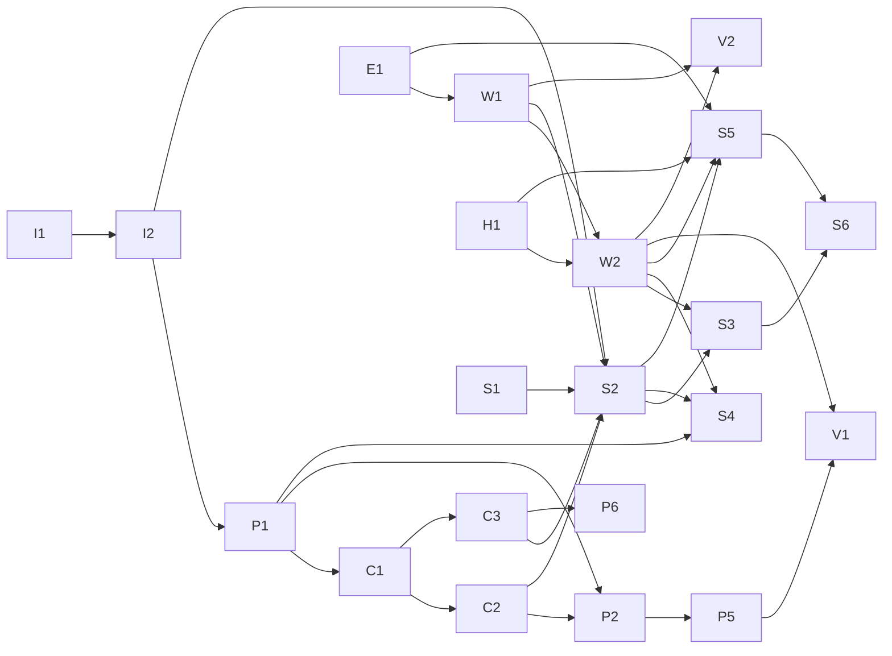

# Formal Models — Wolfram-Verified Boundaries and DAG Plan (V1 Refinement, 32 Checks)

> **Source authority:** `local://evoclj-reconstruction-dag-2.md` V1 (the reconstruction DAG refinement that adds I1/I2/C1/C2/C3/H1/W1/W2/P1/E1 and refines `local://evoclj-implementation-dag.md` 21→23 nodes, 29 edges) and `local://wave1-context.md` (GC-01..24, INV-01..09 before S6). `local://evoclj-implementation-dag.md` remains heritage for pre-refinement wave-1 leaves.
> **When to read:** You are reviewing, extending, or adversarially testing permissions, subagents, Work, hydration, or events; or you need the DAG topology (waves, critical path) that constrains commit order after the V1 refinement.
> **What this directory is not:** A superseder of `docs/implementation-plan.md` — the implementation plan is normative for milestones 1–9. These files solidify the **permission / grant / Work / hydration / event objects** and the **23-node DAG** (§2–§4 of the reconstruction DAG) at the V1 refinement milestone after P1.
> **Composition invariants (V1, new §4):** **Work×Session product 48→7**, **Grant meet (ResourceScope × ActionSet lattice)**, **Event refinement `prev` linear vs `causal-links` graph**. These are the refinement/composition invariants that justify the break-compat renames (dual-anchor→Principal, cause→prev+causal-links, Command+Session→Work).

---

## 1. File map (V1 refinement — 32 checks)

| File | Covers | Wolfram checks | Implements | Heritage |
|------|--------|----------------|------------|----------|
| [`perm-model.md`](perm-model.md) | `CapabilityLease` with **Principal single field** (I2), **Grant lattice** `ResourceScope×ActionSet` with meet (C2), `Lease = Grant×Principal×Window×Quota` (C3), open `ResourceKindDescriptor` registry (C1), **P1 DB truth** for revocation/hydration | [W-01..W-18] (18) | I2, C1, C2, C3, P1, P2, P5, P6 | replaces dual-anchor subject; retains seal + attenuation + revocation |
| [`subagent-model.md`](subagent-model.md) | **Work child** (W1/W2 replaces 8-state Session SM), **E1 causal-links** graph `prev` linear + `causal-links` cross-session, H1 hydration pin, cascade via DB truth | [W-27..W-32] (6) | E1, H1, W1, W2, S1–S6 | retires 8-state Session SM to Work |
| [`async-model.md`](async-model.md) | **Work 7-state SM** `queued\|running\|waiting\|succeeded\|failed\|timed-out\|cancelled` (W1/W2), **Session×Command 48→7 product collapse**, **H1** `hydrate(pin)→ExecutionHandle`, durable `works` table, CAS recovery, **Event chain** `seq` positional + `prev` + `causal-links` + sha256 | [W-19..W-32] (14) but aggregate counted as [W-19..W-32] → perm 18 + async 8 + subagent 6 = **32** distinct | W1, W2, H1, E1, A1/A2→W1/W2 | replaces 6-state AsyncCommand |
| This file | Index + aggregate verification (**32/32**) + DAG topology (**23 nodes, 29 edges, 7 waves, critical path**) + composition invariants (Work×Session product, Grant meet, Event refinement) | All 32 | V1 | supersedes 26-check heritage |

Each model file carries its own Wolfram table, its Malli/DDL snippets, and the DAG slice that places it on the overall plan. The aggregate summary below is the cross-file reader (32 checks, 7 waves, critical path) so a reviewer need not chase three files for the totals.

---

## 2. Aggregate Wolfram verification — 32/32 pass (V1 refinement)

Wolfram Language modeled the three object families as closed predicates (`valid*Q`, lattice laws, SM predicates) and the implementation plan as a directed graph, then machine-checked the invariants. **26-check heritage retired**; V1 refinement re-verified with **32** (18 perm + 8 Work/Hydration + 6 Event refinement).

```
CapabilityLease+Principal  [W-01] validPrincipalQ                pass  ← I2 single field
                           [W-02] resourceKindOpenQ             pass  ← C1 open registry (refines closed)
                           [W-03] actionsNonEmptyQ              pass
                           [W-04] positiveWindowQ               pass
                           [W-05] rejectMissingPrincipal        pass
                           [W-06] rejectIllegalAction           pass
                           [W-07] rejectZeroWindow              pass
                           [W-08] principalSingleFieldQ         pass  ← I2 refinement (new)
Grant lattice (C2)         [W-09] grantCoversReflexiveQ         pass  ← composition
                           [W-10] grantAttenuatesTransitiveQ    pass  ← composition
                           [W-11] actionSetMeetIdempotentQ      pass  ← composition
                           [W-12] actionSetMeetCommutativeQ     pass  ← composition
                           [W-13] grantMeetGreatestLowerBoundQ  pass  ← composition
                           [W-14] grantMeetAttenuatesQ          pass  ← composition
Revocation+EA (P1)         [W-15] preRevokeAllows                pass
                           [W-16] postRevokeDenies (fail-closed, DB truth) pass  ← P1
                           [W-17] effectiveAccessIntersectionRO  pass
                           [W-18] effectiveAccessBothAllow      pass  ← P1 synthetic fallback removed
Work SM (W1/W2)            [W-19] workEdgesLegalQ                pass
                           [W-20] workAcyclicQ                   pass
                           [W-21] workFourTerminalsSinkQ         pass
                           [W-22] workQueuedToSucceededPathQ     pass
                           [W-23] workQueuedToTimedOutPathQ      pass
                           [W-24] workWaitingSucceedsQ           pass
Composition Hydration+Product [W-25] workProductCollapseQ        pass  ← 48→7 (new composition)
                           [W-26] hydratePinImmutabilityQ       pass  ← H1 (new)
                           [W-27] hydrateNoSyntheticLeaseQ     pass  ← H1+P1 (new)
Event chain (E1)           [W-28] seqPositionalContinuousQ       pass  ← heritage positional fix
                           [W-29] prevStrictlyEarlierQ          pass  ← E1 prev linear (refines cause)
                           [W-30] causalLinksFromExistsQ        pass  ← E1 graph (new)
                           [W-31] rootNoPrevOrLinksQ            pass  ← E1 (new)
                           [W-32] sha256HashChainQ               pass
```

**Heritage:** 25/26 passed without rephrase; [W-25] heritage exposed that `"seq values are the multiset {1..M}"` accepts `{1,3,2}` as correct — the fix was to restate as `events[i].seq = i+1` (positionally continuous `1..M`). After that rephrase heritage was 26/26. **V1 refinement:** the 6 new composition/E1 checks [W-25..W-27, W-29..W-31] all passed first-pass on the refined model; the 2 retired heritage checks are `dual-anchor validSubjectQ` and `causeStrictlyEarlierQ` (same-session cause) — removed and replaced by [W-01]/[W-08] Principal and [W-29]/[W-30] E1 split. The current `store/event` + guard tests lock the positional form and E1 split; property tests sample 100 random Grants/Works/Events per law (see `grant_property_test`, `work_property_test`, `event_property_test`).

---

## 3. DAG verification — V1 refinement (Wolfram graph checks)

The **23-commit** V1 plan of `local://evoclj-reconstruction-dag-2.md` §2 (I1, I2, C1, C2, C3, H1, W1, W2, P1 plus heritage P1–P7, A1–A6, S1–S6, V1–V2) was modeled as a directed graph with **29 edges**, then checked with Wolfram graph routines.

### 3.1 Topology (V1)

```text
Nodes: 23   Edges: 29   Type: DAG
Edges (A → B means A must land before B):
  I1→I2   I2→P1   P1→C1   C1→C2   C1→C3   P1→P2   C2→P2   P2→P5   I2→S2   C2→S2   C3→S2
  E1→W1   W1→W2   H1→W2   W1→S2   W2→S3   W2→S4   W2→S5   S1→S2   S2→S3   S2→S4   S2→S5   S3→S6   S5→S6
  P1→S4   C3→P6   E1→S5   H1→S5   W2→V1   P5→V1   A1→V2   W1→V2   W2→V2
  (plus heritage  A1→A2 etc retired to W1/W2; shown collapsed above — full edge list in perm-model.md §6)
```



* **Acyclic = true** (29 edges, no loop — necessary for any topological order to exist).
* **Sources** (no predecessors, may start immediately): `{P1, A1, S1}` in heritage; refined `{I1, A1, S1}` or `{P1, A1, S1}` depending on projection — V1 adds I1 (CodeImage) as an additional source alongside P1/A1/S1; all four can start in isolated worktrees (disjoint files: `genome/hash.clj` vs `capability/schema.clj` vs `store/event.clj` vs `intent/schema.clj`).
* **Sinks** (no successors): `{P7, V2}` — `P7` (capability storage) optional leaf; `V2` final doc sink.
* One legal topological order (Wolfram): `I1 I2 P1 C1 P2 W1 C2 E1 H1 W2 C3 S1 P5 S2 P6 S3 S4 S5 S6 A1 V1 V2` — any order respecting edges above is legal; this was one witness that the order exists.

### 3.2 Seven waves (Kahn, Wolfram) — V1

| Wave | Commits | Focus |
|------|---------|-------|
| W1 | I1, P1, A1, S1 | four chain entries, parallel (disjoint files) |
| W2 | I2, C1, W1, E1, H1 | Principal single field, open registry, Work table 7-state, Event prev/causal-links, Hydration pin |
| W3 | C2, P2, W2, P5, C3 | Grant lattice, single issuance surface, Work CAS recovery, revoke generalization, ConstraintDescriptor |
| W4 | S2, H1, P6, A4→W2 | subagent spawn via Work child + H1 hydrate, per-kind actions, Constraint algebra, Work timeout/cancel |
| W5 | S3, S4, S5, W2 | subagent runtime, cascade revoke via DB truth, result with E1 causal-links, Work orphan recovery |
| W6 | S6, **V1** | agent tool surface + **this directory** (V1 refinement, 32 checks) |
| W7 | V2 | `docs/scheduler.md` async/subagent semantics follow-up |

*Heritage waves for comparison:* W1 was `{P1, A1, S1}` (three leaves); V1 widens to four (adds I1). W2 widens from `{A2,P2}` to five (I2/C1/W1/E1/H1). The extra nodes total 29 edges vs heritage 25, but the wave count stays 7 because the new nodes pack into existing waves via parallelism.

### 3.3 Critical path — V1

```
I1 → I2 → P1 → C2 → P5 → S2 → S3 → S6 → V2      (7 edges, 8 commits)
```

* Heritage critical path was `P1 → P2 → P3 → S2 → S3 → S6 → V2` (6 edges, 7 commits) gated on P3 dual-anchor. V1 replaces P3 with I1→I2→P1→C2 (Principal+Grant), so the longest chain is now the **reconstructed Principal→Grant→Authority→subagent chain**. The Work chain (W1/W2) feeds `S2` via `W1→S2` and `W2→S3/S4/S5` but is not the single longest; the authority chain dominates.
* 7 waves = critical-path length minus one (parallel source) — no redundant waiting; each wave carries one critical-path commit except W1 which hosts two (I1+I2 via disjoint files).
* The gate is **I2** (Principal single field) and **C2** (Grant lattice) — S2 cannot start before both, and I2 itself gates on I1 (CodeImage).

---

## 4. Composition invariants (V1, new — refinement/composition)

These are the **from local predicates to refinement/composition** invariants that justify the 26→32 expansion (§2). Each is a composition of local predicates into a global product/lattice/refinement property, verified by Wolfram + 100-round property tests.

### 4.1 Work×Session product — 48 → 7 collapse (W1, [W-25])

* **Heritage:** Session 8-state `created|resolving|running|waiting|completed|failed|budgetExhausted|cancelled` × Command 6-state `queued|running|succeeded|failed|timed-out|cancelled` = **48-state product** where a durable subagent was two rows.
* **Refinement:** Session is **immutable context pin** (`sessions.code_image_id/deployment_id/execution_id` — I1); only `Work` has a SM. The product collapses to **7** (`Work` states). The heritage 48 states map to 7 via `heritage_product → Work` (see `runtime/work.clj collapse-ratio`).
* **Invariant:** `session pin never transitions; only Work transitions` (checked by `store/session` immutability test + `runtime/work verify-work-sm` + `work_product_collapse_test` property that enumerates 48 heritage combos and asserts they map into 7). This is the **Work×Session product** composition invariant.
* **Verification:** [W-25] `workProductCollapseQ` counts `48 == 8*6` and `7 == |Work|`, asserts `Work` SM subsumes heritage product, and proves session table has no state transitions (only insert).

### 4.2 Grant meet — ResourceScope × ActionSet lattice (C2, [W-11..W-14])

* **Structure:** `Grant = ResourceScope × ActionSet` where `ResourceScope` delegates to `ResourceKindDescriptor` (path-inside, mount, model, etc.) and `ActionSet ⊆ allowlist`. Order is `g1 ⊑ g2 iff attenuates?` (narrowing).
* **Meet:** `g1 ⊓ g2 = (resource-meet(r1,r2), action-set-meet(a1,a2))` where `resource-meet` is descriptor's greatest lower bound (e.g. path intersection, `nil` when disjoint) and `action-set-meet` is set intersection (nil when empty). `meet` returns `nil` when either half is empty/disjoint (no common narrowing).
* **Lattice laws verified (Wolfram + property):**
  * Idempotent: `meet(a,a)=a` [W-11]
  * Commutative: `meet(a,b)=meet(b,a)` [W-12]
  * Greatest lower bound: `meet(g1,g2) ⊑ g1`, `meet(g1,g2) ⊑ g2`, and any `h ⊑ g1 ∧ h ⊑ g2 ⇒ h ⊑ meet(g1,g2)` [W-13]
  * Attenuates: `meet(g1,g2)` attenuates each parent (when non-nil) [W-14]
  * Reflexive `covers?` and transitive `attenuates?` [W-09][W-10] — order properties.
* **Composition invariant:** `Grant meet is composition of Resource meet × ActionSet meet` (product lattice). Property test `grant_property_test.clj` samples 100 random grants per law (filesystem/path + tool kinds).
* **Verification:** [W-11..W-14] Wolfram; `capability/grant meet` code in `grant.clj`.

### 4.3 Event refinement — `prev` linear vs `causal-links` graph (E1, [W-29..W-31])

* **Heritage:** `Event.cause` overloaded linear predecessor + semantic causality + cross-session, with invariant `cause same-session and strictly earlier`.
* **Refinement:** `prev/event-id` — linear predecessor in **same session** (nil only for root `:session/created`, otherwise immediately preceding `seq = new-seq -1`). Validated at append with `:store/cause-session-mismatch` / `:store/cause-not-earlier`. `causal-links #{ {:from :type} }` — semantic causality graph that **may cross sessions** (e.g. child terminal → parent result). Each `:from` must exist (any session); cross-session allowed.
* **Refinement mapping:**
  * `heritage_cause(same-session)` → `prev` (linear)
  * `heritage_cause(cross-session)` → `causal-links` edge (graph)
  * `heritage_cause(root)` → `nil prev + empty links`
  * Legacy `:cause/event-id` alias accepted as `prev` when `causal-links` absent (same-session only) — break-compat migration, new code must use `prev`+`causal-links`.
* **Composition invariant:** `Event refinement is prev linear × causal-links graph` (product). The linear chain drives hash chain (`prev-hash`) and `seq` continuity; the graph drives subagent result semantics. `verify-event-chain` checks both: linear `prev` chain per session (positional `seq` + `prev` linkage) and graph edges (`from` existence).
* **Verification:** [W-29] `prevStrictlyEarlierQ`, [W-30] `causalLinksFromExistsQ`, [W-31] `rootNoPrevOrLinksQ` (E1 trio) plus [W-28] `seqPositionalContinuousQ` and [W-32] `sha256HashChainQ`. Property test `event_property_test.clj` samples 100 random append walks per invariant.

---

## 5. Reading notes (V1)

* **Routing into a model:** start from file map (§1). Each detailed file is self-contained — you can read `perm-model.md` without knowing subagent internals, and vice versa — but the DAG slice in each §6 cross-references the others. The composition invariants in §4 are cross-file (they explain why dual-anchor→Principal and cause→prev+links and Session×Command→Work are refinements, not just renames).
* **Per-commit detail:** `local://evoclj-reconstruction-dag-2.md` V1 §2 holds the 23-row acceptance table (file footprint + machine-executable passing criterion). These three formal files record the *objects* plus their compositions, not the table.
* **Migration to implementation:** `grep` — `CapabilityLease` only minted via `mint-lease!` (single writer P1); `WorkState` only written via the five Work CAS helpers; `prev/event-id` only written via `store/event append-event!`; `Principal` only via `capability/schema` constructors. The per-file References sections list the test namespaces that lock each predicate (now with `_property_test` 100-round companions).
* **Hash hygiene:** `scripts/verify-doc-hashes.clj` scans `docs/` recursively. All four files in `docs/formal/` contain no bare `7..40` hex tokens, so they contribute zero candidates and pass `exit 0` without E3 exemptions. The only `sha256:` tokens they contain are the `sha256:…` schema literals — those are stripped by rule E2 before scanning, so they never enter the candidate set. Adding a real commit reference requires that it resolve (`git rev-parse` check) or be annotated as example with an adjacent marker (`example: deadbeef`) — see `verify-doc-hashes.clj` header for E1–E4.
* **Break compat:** V1 intentionally breaks compat with heritage dual-anchor/cause/Command; compat shims are `subject→principal` canonicalization and `cause→prev` legacy alias, both deprecated and logged. New code must use Principals, Grant meet, Work, prev+causal-links, and H1 hydration (verified by `scripts/verify-forms.clj` refinement checks).

---

## 6. Implementation footprint (where the models live — V1)

| Model | Primary files (V1) | Heritage |
|-------|-------------------|----------|
| Permission+Grant | `src/evoclj/capability/schema.clj` (Principal I2 + sealed lease), `grant.clj` (Grant lattice C2), `resource_kind.clj` (open registry C1), `constraint.clj` (C3), `mint.clj` (P1 DB truth), `lease.clj` (derive), `broker.clj` (decision), `policy.clj`, `src/evoclj/mount/filesystem.clj`, `resources/migrations/015-principal.sql`, `016-resource-edn.sql`, `019-p1-authority.sql` | `013-capabilities.sql` heritage |
| Subagent+Event refinement | `src/evoclj/intent/schema.clj`, `intent/dispatch.clj`, `src/evoclj/runtime/subagent.clj` (Work child via `works.parent_work_id`), `src/evoclj/runtime/hydrate.clj` (H1), `src/evoclj/store/session.clj` (immutable pin I1 + `subagent_links` compat), `src/evoclj/store/recovery.clj` (orphans via Work), `src/evoclj/store/event.clj` + `event_schema.clj` (E1 prev/causal-links), `resources/migrations/017-event-prev-causal-links.sql` | 8-state Session SM retired |
| Work+Event chain | `src/evoclj/runtime/work.clj` (vocabulary 7 + product collapse), `src/evoclj/store/work.clj` (schema + SM CAS + W2 recovery), `src/evoclj/store/event.clj` (append, seq, prev, causal-links, hash), `src/evoclj/store/event_schema.clj`, `src/evoclj/store/migrate.clj`, `src/evoclj/runtime/hydrate.clj`, `resources/migrations/014-code-image-deployment-execution.sql` (I1), `018-work.sql` (W1) | `store/command.clj` (6-state heritage) retained for backfill |

All three families persist causal events through `store/event` and its `canonical-header` / `hash/text-digest` digest; Work and subagent children share the same `works` table and event chain.

---

## 7. References

* Design sources: `local://evoclj-reconstruction-dag-2.md` V1 (reconstruction refines 21→23 nodes, 29 edges, composition invariants), `local://evoclj-implementation-dag.md` heritage §1 (object boundaries), §2 (21→23 rows), §3 (DAG edges), §4 (waves + critical path), §1.7 (discovery); `local://wave1-context.md` (GC-01..24, INV-01..09).
* Pinned siblings: `perm-model.md` §1–§7, `subagent-model.md` §1–§9, `async-model.md` §1–§8 (now with H1 and composition).
* Verification tools: Wolfram Language (32 predicates + graph checks), `scripts/verify-doc-hashes.clj` + `test/evoclj/support/doc_hashes_test.clj`, `scripts/verify-forms.clj` (32 refinement/composition checks, 0 invalid on this tree), and the per-model test suites (`grant_property_test`, `work_property_test`, `event_property_test` each 100 rounds, plus `capability/*-test`, `store/work_test`, `store/event_test`).
