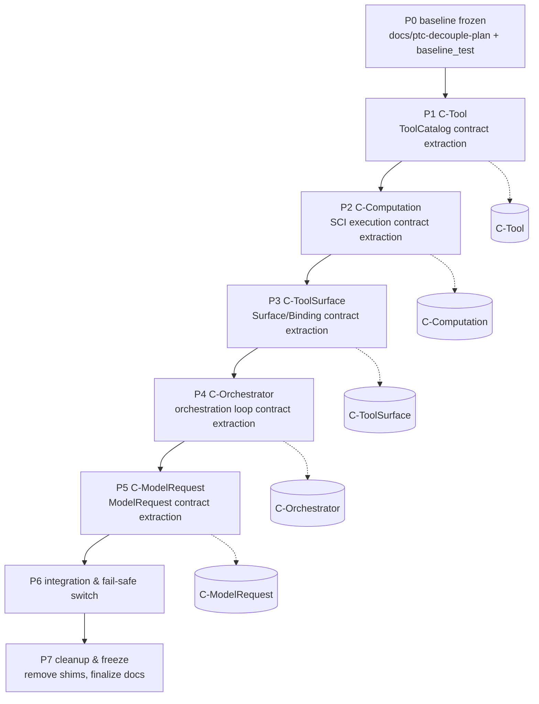

# PTC Decouple Plan (Persistent Baseline)

> **Status: P0 frozen baseline** — This document is the single authoritative entry for P1–P7. Any implementation deviation must first update this plan and pass review.  
> **Constraints: Do not change `src/` behavior; only add docs and tests; one commit per feature; exclusive serial execution per slice.**

## 1. Background and Problem

Current `dispatch-with-tools!` (`src/evoclj/runtime/scheduler.clj:464`) conflates three responsibilities:

1. **Prompt assembly** — Merges `BaseModelCall + SessionBindings + CatalogProjection + History` via `evoclj.runtime.assembler/base->prepared` into `PreparedModelCall` (containing `:messages/:tools/:tool-map/:prompt/provenance`).
2. **Tool loop** — Fixed `max-tool-rounds=4` loop that each round resolves `tool-map`, executes via `capability/broker`, appends `assistant+tool` messages, and recurs.
3. **Computation boundary** — Each round's provider call depends on `intent/dispatch` transaction and SCI boundary (`sci.limits/make-interrupt-fn` throws `sci.interrupt/interrupt!`, which must not be catchable inside SCI).

Consequences: `visible-to-model` (wire `:tools`) and `executable-by-scheduler` (local `:tool-map`) are produced by the same closure and cannot evolve independently; pin semantics for ToolSurface and refresh semantics for Context are fused in one `assemble` call; Orchestrator cannot independently retry/circuit-break a single round.

## 2. Top-Level Decomposition



**Serial discipline:** Exclusive slice execution to avoid affine conflicts on `.cpcache / evoclj-state/db / compile cache`; next P starts only after previous P is green; one commit per P.

Dependency direction:

```
P0 -> P1 -> P2 -> P3 -> P4 -> P5 -> P6 -> P7
     |- C-Tool -|
          |- C-Computation -|
               |- C-ToolSurface -|
                    |- C-Orchestrator -|
                         |- C-ModelRequest
```

Any contract change must be backward compatible or be switched atomically in P6.

## 3. Cross-Slice Contracts

### C-Tool — ToolCatalog Contract

- **Provider:** `evoclj.provider.registry / evoclj.provider.modelsdev / evoclj.mcp.*`
- **Consumer:** Assembler, Scheduler `dispatch-with-tools!`, `broker/authorize`
- **Data:** Vector of `{:tool/name :tool/id :tool/parameters :tool/description}`; wire name = `:name`, execution identity = `:tool` (convention in `src/evoclj/provider/openai/wire-tools` and `scheduler/tool-map-of`).
- **Invariants:**
  - Wire name is unique, execution id is stable (`C-Tool/id-stable`).
  - `:tools` (wire side) and `:tool-map` (execution side) produced by `assemble` share the same origin; they must not diverge.
- **Failure:** `resolve-tool-catalog` throws `:provider/catalog-unresolved-tool` for dangling ids (S14 fail-closed).

### C-Computation — SCI Execution Contract

- **Provider:** `evoclj.sci.context / limits / execute / boundary`
- **Consumer:** All SCI handlers in `evoclj.runtime.node`, `evoclj.evolution.*`
- **Data:** `Runtime = {:context SCIContext :programs {id {:source :entry}}} + {:evoclj/interrupt-state (atom check-fn)}`
- **Invariants:**
  - `limits/make-interrupt-fn` throws `sci.interrupt/interrupt!` which **must not be catchable inside SCI** (`invoke!` uniformly converts it to `{:status :error :error {:error/type :sci/limit-exceeded}}`).
  - `boundary/materialize-edn` ensures cross-boundary values are EDN-safe with no lazy seqs/functions/Java objects (GC-22).
  - `:interrupt-fn` installed by `load-program!` is delegating; `invoke!` swaps `reset!` per call so reused compiled functions remain bounded.
- **Failure:** `:sci/limit-exceeded`, `:program/input-invalid`, `:edn/size-exceeded` are typed serializable errors.

### C-ToolSurface — ToolSurface/Binding Contract

- **Provider:** `evoclj.context.materializer / evoclj.runtime.assembler / evoclj.environment.* / evoclj.skill.*`
- **Consumer:** Per-round `materialize` in Assembler, `fetch-bindings` in Scheduler
- **Data:** `SessionBindings = [{:binding/id :logical/id :revision/id :binding/descriptor}]`; `CatalogProjection = {logical-id revision-id}`; `EffectiveContext = {:effective/history :effective/segments :effective/bindings}`
- **Invariants:**
  - **Pin stability:** `assembler/pin-catalog` (`capture-tool-catalog-binding`) is captured once at `dispatch-with-tools!` entry and stays constant for the entire 4 rounds; even if the host refreshes `CatalogProjection` with new tools, the loop keeps the pinned snapshot (`scheduler.clj:502-532`).
  - **Refresh variability:** Each round recomputes `EffectiveContext` from fresh `SessionBindings + CAS`, so a new `ContextBinding` created by `activate_skill` is visible next round (`rebuild-context` semantics).
  - **Fail-closed placeholder:** Without CAS, an unresolvable placeholder throws `:assembler/placeholder-unresolved`; no degraded segment is emitted.
- **Failure:** `:context/materializer-missing-cas`, `:assembler/placeholder-unresolved`.

### C-Orchestrator — Scheduling Loop Contract

- **Provider:** `evoclj.runtime.scheduler` (`run-session!`, `dispatch-with-tools!`, `dispatch-intent!`)
- **Consumer:** `evoclj.runtime.node / phenotype / session`
- **Data:** `Intent = {:intent/type :intent/model-call :payload {:base/messages :requested-tools :model/id :options {:max-tool-rounds 4}} :budget}`; `Step = {:outputs [...] :last-event Event}`
- **Invariants:**
  - `max-tool-rounds` defaults to 4 (`max-tool-rounds-default`), sourced from `intent.payload.options.max-tool-rounds`, decremented each round; stops when `tool-calls` empty, `rounds==0`, or `tool-map` empty.
  - Non `:intent/model-call` intents bypass Assembler and go directly to `dispatch-intent!`.
  - Each round produces `effective-intent` via Assembler (overwrites `:payload :messages/:tools`, retains `:base/messages/:requested-tools`); `dispatch-intent!` yields `value.tool-calls` to drive next round; unknown tool throws `:scheduler/unknown-tool`.
- **Failure:** `:scheduler/unknown-tool`, `:provider/catalog-unresolved-tool` (S14 gate), `:intent/failed` (dispatch exception persisted).

### C-ModelRequest — ModelRequest Contract

- **Provider:** `evoclj.runtime.assembler/base->prepared` + `evoclj.provider.{openai,anthropic,dialect}`
- **Consumer:** Provider adapter layer via `intent.dispatch`
- **Data:** `PreparedModelCall = {:messages [...] :tools [...] :tool-map {...} :prompt/provenance {...} :context/manifest {...} :tool-catalog/binding {...} :base BaseModelCall :effective EffectiveContext}`
- **Invariants:**
  - `split-base-messages / prioritized-prompt` orders by trust `kernel > extra > user > model`, first block is `:prompt/provenance` audit header, `validate-kernel-priority!` is fail-closed.
  - `:tool-map` key is wire `:name` (not `:tool/id`).
  - `history` may be string or message vector, unified into `manifest`.
- **Failure:** `:prompt/kernel-overridden`, `:prompt/unattributable`.

## 4. P0–P7 Acceptance Criteria

| Phase | Goal | Acceptance (machine-checkable) | Output |
|-------|------|-------------------------------|--------|
| **P0** | Baseline frozen | `docs/ptc-decouple-plan.md` exists with §2 diagram + §3 five contracts + this table; `test/evoclj/ptc/baseline_test.clj` three assertion groups green; `git diff --stat` shows no `src/` change; single commit `docs(ptc): freeze baseline plan and characterization tests` | This doc + baseline_test |
| **P1** | C-Tool extraction | New `evoclj.ptc.tool` port/protocol, `registry/resolve-tool-catalog` is single source of truth, `tool-map-of` is thin wrapper; old path delegates; contract tests: wire name <-> execution id bijection, dangling fail-closed | `src/evoclj/ptc/tool.clj` + test |
| **P2** | C-Computation extraction | New `evoclj.ptc.computation` port, `execute/invoke!` only via port; interrupt-uncatchable + EDN boundary assertions stay green; no new threads/watchdogs | `src/evoclj/ptc/computation.clj` + test |
| **P3** | C-ToolSurface extraction | New `evoclj.ptc.tool-surface`, `pin-catalog` and `materialize` are separate interfaces, `rebuild-context` is pure; pin-stable / refresh-variable assertions green | `src/evoclj/ptc/tool_surface.clj` + test |
| **P4** | C-Orchestrator extraction | New `evoclj.ptc.orchestrator`, `dispatch-with-tools!` split into `prepare -> dispatch -> execute-tool-calls -> recur` injectable steps; `max-tool-rounds=4` default and passthrough tests green; non-model-call still direct | `src/evoclj/ptc/orchestrator.clj` + test |
| **P5** | C-ModelRequest extraction | New `evoclj.ptc.model-request`, `base->prepared` only via port; trust ranking and provenance header tests green; provider adapters have no direct assembler dependency | `src/evoclj/ptc/model_request.clj` + test |
| **P6** | Integration & fail-safe switch | Introduce `:ptc/enabled?` (`resources/system.edn` default `false` keeping old path), `true` routes via PTC ports, `false` keeps 1:1 old behavior; 13/13 e2e no regression; `clojure -M:test` full suite green (or exclusive new-ns green) | `system.edn` + switch + e2e |
| **P7** | Cleanup & freeze | Remove compat shims and old direct paths; contract-doc vs implementation consistency audit; `verify-doc-hashes` green; mark `docs/ptc-decouple-plan.md` as `FROZEN` and archive | Cleanup commit + finalized docs |

**Global gates:** Each phase satisfies INV-05 (single implementation), INV-09 (tests go through production path), GC-22 (EDN only across boundaries) and §5 discipline.

## 5. Execution Discipline

- **One commit per feature:** Each `P<n>` is its own commit, message `feat(ptc): [P<n>] <contract> <verb>`; P0 is `docs(ptc): freeze baseline plan and characterization tests`.
- **Serial exclusive:** Single-slice exclusive execution to avoid affine conflicts on `.cpcache / evoclj-state/db / compile cache`; blocking progression, next P starts only after `clojure -M:test -n evoclj.ptc.*` is green for previous P.
- **No behavior change (P0–P5):** Only add `src/evoclj/ptc/*` ports and delegation; do not change existing semantics in `src/evoclj/runtime/scheduler.clj` etc.; switching happens in P6, removal in P7.
- **Fail-safe switch:** Add `:ptc/enabled? false` (default off) in `resources/system.edn`, read by `src/evoclj/kernel/system.clj` to decide whether to go via PTC ports; the switch itself has contract tests (old path 1:1 when `false`, new path equivalent when `true`).
- **Tests first:** Each P starts with failing contract tests (`test/evoclj/ptc/<slice>_test.clj`), then port implementation, then full regression.
- **Observability:** Each P appends a row to §6 progress table (commit SHA, test count, regression result).

## 6. Progress

| Phase | Commit | Tests | Regression | Notes |
|-------|--------|-------|------------|-------|
| P0 | 215b932e | `evoclj.ptc.baseline-test` 3 groups green | `src/` zero change | Frozen by this doc |
| P1 | 9caf75a9 | `evoclj.ptc` Tool value object (D1) | baseline green | Tool VO unified |
| P2 | fb08255b | `evoclj.sci.computation` Computation VO (C4/D4) | baseline green | Computation VO |
| P3 | 9bc18ef1 | `evoclj.runtime.tool-surface` (C3) | baseline green | ToolSurface VO |
| P4 | 6849863d | `evoclj.provider.request` ModelRequest (D2) | baseline green | ModelRequest |
| P5 | 6849863d/e5f92b5d | Orchestrator protocol (C1) + EffectPipeline (C2/C5/D3) | baseline green | Orchestrator/Pipeline |
| P6 | 3a871f27 | CodeModeOrchestrator slit fail-safe off | codemode green | Slit off |
| P7 | 7a2a4159 | Slit abstraction inject Computation | codemode green | Slit correct |
| P8 | c5ed8828 | sandbox tool_fn injection (limits lattice) | true-loop green | toolFns injection |
| P9 | b5a55324 | declare code_execution tool | true-loop green | tool declared |
| P10 | 7b931597 | wire CodeMode true loop | 4 tests green | true loop |
| P11 | _this_ | `evoclj.ptc.e2e-test` 16 tests / 58 assertions + `evoclj.adversarial.ptc-adv-test` 11 tests / 57 assertions — total ptc+adv 42/188 green | `src/` zero change (tests+docs only, deterministic, serial exclusive) | PTC e2e + adversarial final: sequential two tools via code, branching if, try/catch fail-closed (try not in allow), limits 32 ok/33 fail + 8192 bytes, 1 vs 4 roundtrips equivalence same output, materialize-edn rejects Java object via tool; GC-07 System/exit rejected, GC-08 provider not in toolFns not available, GC-09 visible vs authorized denied, GC-22 lazy/Java boundary, interrupt uncatchable, GC-20 attribution present |
## 7. Risks and Mitigations

- **Cache pollution:** Concurrent writes to `.cpcache` cause flaky compilation — Mitigation: serial + exclusive + single-namespace `clojure -M:test` per P.
- **Switch divergence:** Long-lived dual paths drift — Mitigation: P7 removes old path on deadline, contract tests cover equivalence of both paths.
- **Interrupt semantics regression:** SCI interrupt mistakenly caught causing infinite loop — Mitigation: Keep `sci/limits` baseline test as regression net in P2.

## 8. References

- `src/evoclj/runtime/scheduler.clj:464-591` `dispatch-with-tools!` (pin vs refresh comments)
- `src/evoclj/runtime/assembler.clj:15-142` `base->prepared / pin-catalog / rebuild-context`
- `src/evoclj/sci/limits.clj:69-102` `make-interrupt-fn` (`sci.interrupt/interrupt!` uncatchable)
- `src/evoclj/sci/execute.clj:248-330` `invoke!` delegating interrupt
- `docs/invariants.md` INV-05/INV-09, GC-02/GC-22
